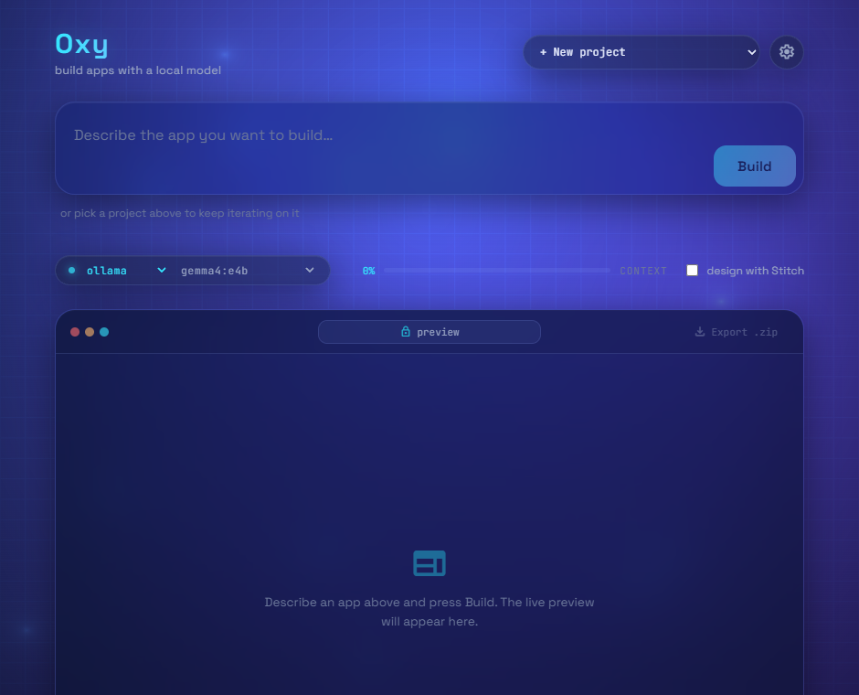

# Oxy

**Build web apps with a local LLM. Simple, beautiful, just works.**

Oxy is a local-first coding tool: describe the app you want, and a model running
**entirely on your machine** builds it — writing the files, generating images and
icons, previewing the result, and refining its own design. No cloud account, no
API keys required, nothing to configure.

> Oxy is the productized descendant of the **Reasoning Lab** research bench, where
> the orchestration techniques below were discovered and measured. The bench keeps
> experimenting; proven findings get ported here.

## Why it's different

The model isn't the product — the **orchestration layer** is. Small local models
are weak on their own, so Oxy wraps them in techniques that make them punch far
above their weight:

- **Auto-compact** — when the context fills, Oxy checkpoints the build state to
  disk and continues from a fresh, small context. Lets a small model build things
  bigger than its context window, and makes builds resumable after a crash/sleep.
- **Thinking-burst** — the model reasons hard for exactly one step after a design
  critique or an error, then goes quiet again (the trace never bloats context).
- *(porting from the bench)* agreement/best-of-N, fresh-restart escalation, and
  logprob-confidence routing.

Plus: a **jailed workspace** (the model can only touch its own project folder), a
**sandboxed preview**, real **SVG icons** and a **design system**, optional local
**Stable Diffusion** images and **Google Stitch** design.

## Install & run

```sh
npm install
npm run dev      # open the UI; describe an app and press Build
```

On first use Oxy picks an engine automatically: if **Ollama** is running it uses
that (instant, nothing to download). Otherwise it falls back to a **managed
llama-server** — on the first build Oxy downloads a prebuilt `llama-server` binary
(no compiler) and the default **gemma4** model, then runs it for you. It
auto-detects your GPU (CUDA/Vulkan, else CPU). Nothing to install manually either
way.

Prefer the terminal? Build headlessly:

```sh
npm run oxy      # default: managed llama-server + gemma4
# OXY_ENGINE=ollama OXY_MODEL=gemma4:e4b OXY_TASK="build a ..." npm run oxy
```

## The interface



A clean, calm **light** interface — designed in **Google Stitch**
(`design/stitch-ui.html`, regenerate with `node design/gen-stitch.mjs`) over a
subtle drifting pastel aurora. It has a prompt box, an engine/model picker, a live
build timeline that surfaces the orchestration (context-pressure meter,
`thinking` / `compacted` cues), a sandboxed preview, and one-click **Export .zip**.

- **Iterate, don't restart.** Pick an existing project from the switcher and
  describe a change — the model reads the current files and edits in place.
- **Bring your own keys.** The Settings panel saves your Stitch API key to a
  git-ignored file (never committed, never sent back to the browser).

## Engines

Inference runs through one `Engine` interface (`engine/engine.ts`) so the agent
loop is backend-agnostic:

- **`engine/llama-server.ts`** — **the default.** On first use Oxy downloads a
  *prebuilt* `llama-server` from llama.cpp's releases (no compiler) and fetches the
  GGUF itself (`-hf`, default **gemma4 E4B**), runs it in the background, and drives
  it via the OpenAI-compatible adapter. You still just `npm run dev` — Oxy manages
  everything, and **auto-detects your GPU** (NVIDIA→CUDA, else Vulkan, else CPU;
  macOS→Metal), falling back to CPU if the GPU backend fails. Override with
  `OXY_LLAMA_VARIANT`. Runs the newest models (e.g. gemma4) by tracking the latest
  llama.cpp release.
- **`engine/ollama.ts`** — for people who already run Ollama (instant, reuses your
  pulled models, e.g. `gemma4:e4b`); used automatically when Ollama is detected.
- **`engine/openai-compat.ts`** — the shared transport under llama-server/Ollama; also
  works standalone against **any OpenAI-compatible server** (LM Studio, Jan, vLLM, a
  remote endpoint) — point it at a base URL in the model picker.

When Ollama is running Oxy uses it (gemma4, instant). Otherwise it defaults to the
**managed llama-server** so a fresh clone gets gemma4 with nothing to install. Tool
calls that small models emit as text are recovered by a known-tool-gated parser
(`engine/tool-parse.ts`).

## Architecture

```
agent/      engine-agnostic loop: tools, auto-compact, thinking-burst, token accounting
engine/     Engine interface + llama-server (managed), ollama, openai-compat adapters
server/     jailed backend (file tools, preview, SSRF-guarded web, SD, Stitch) —
            mounted in Vite (codeLabPlugin) or run standalone (serve.mjs)
driver/     headless build driver (run-build.ts)
src/        the React UI (designed in Stitch)
design/     the Stitch-generated design reference
skill/      system.md — the agent "skill" (optimizable prompt) builds read
skillopt/   self-optimizing-skill loop (SkillOpt-style)
```

## Self-optimizing skill (SkillOpt)

The agent's `SYSTEM` prompt lives in `skill/system.md` — a small, inspectable
"skill" that every build reads. `npm run skillopt` tunes it the way Microsoft's
[SkillOpt](https://github.com/microsoft/SkillOpt) tunes agent skills: build a set of
benchmark tasks with the current skill → score each (renders cleanly? required
elements present? finished?) → a stronger *optimizer* model proposes one focused
edit → **accept only if the held-out validation score strictly improves** → deploy
to `skill/system.md`. The model weights never change; only the text does.

```sh
# optimize on a fast model, deploy the skill (it transfers to the local default)
OXY_ENGINE=ollama OXY_OPT_MODEL=gpt-oss:120b-cloud npm run skillopt
OXY_SO_LIMIT=1 OXY_SO_MAXITER=8 npm run skillopt   # quick smoke
```

The loop logic and scorer are unit-tested; a full run is slow (it's offline
"training" — many builds), so optimize on a fast model and let the tuned skill
transfer to the local model.

## Develop

```sh
npm test         # agent-loop + adapter unit tests (Node's built-in runner, no extra deps)
npm run typecheck
npm run build    # type-check + production bundle
```

## Status

v0.1 — working end to end (build via the UI or `npm run oxy`), verified with a real
**gemma4** build through the managed **llama-server** (GPU auto-detected, no Ollama,
no compiler) and via **Ollama**. See [PLAN.md](PLAN.md) for the roadmap and
[DESIGN.md](DESIGN.md) for where we're headed — generating **backends** with
small-context models (spec-first, per-file), **mobile** (iOS/Android) targets, and
the curated-vs-generic **MCP** decision.
